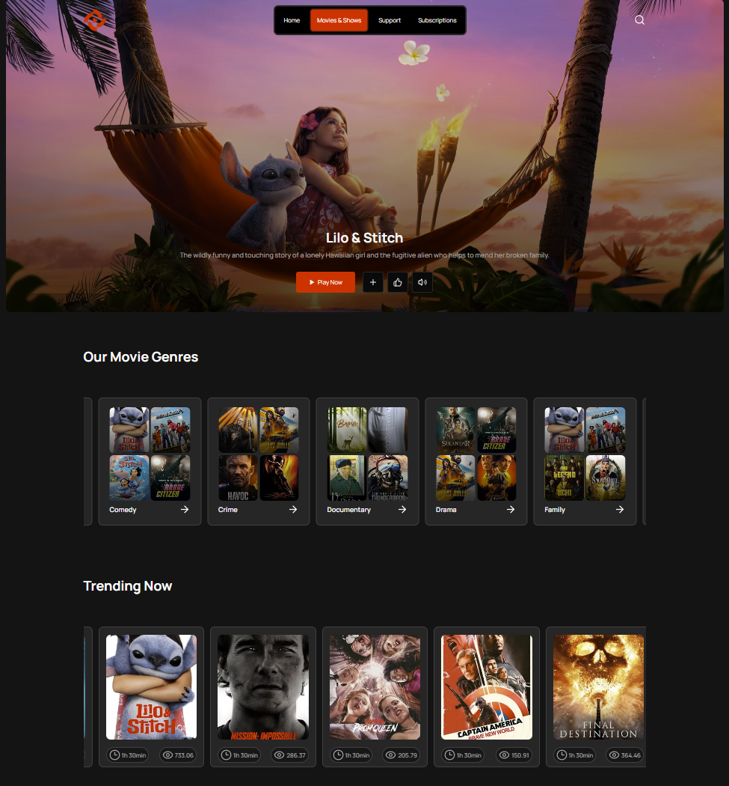

# 🎬 MovieStream — Streaming App for Movies & TV Shows

**MovieStream** is a modern streaming-style web app built with **Next.js**, **TanStack Query**, and **TMDb API**. It allows users to discover, filter, and explore movies and TV series based on genres, language, release year, and more.



---

## 🚀 Tech Stack

- **Next.js** — App routing and SSR
- **React** — Component-based UI
- **TanStack Query** — Data fetching and caching
- **Tailwind CSS** + **ShadCN UI** — Styling
- **Embla Carousel** — Responsive sliders
- **TMDb API** — Movie & TV show database

---

## ✨ Features

- 🔍 Search movies and TV shows
- 🗂️ Categories: popular, trending, top-10
- 🎯 Filters:
    - By genres
    - By original language
    - By release year
- 🌓 Dark/light mode support
- 📱 Responsive design
- ❤️ Favorites (coming soon)

---

## 📦 Installation

```bash
# Clone the repository
git clone https://github.com/Berswow/stream-app-next.git
cd stream-app-next

# Install dependencies
npm install

# Add environment variables
touch .env.local

NEXT_PUBLIC_TMDB_API_KEY=your_tmdb_api_key_here

# Run development server
npm run dev 
```

---

🔮 Coming Soon

 - Auth + user-specific favorites
 - Embedded player support
 - Localization (i18n)
 - Offline support (PWA)

---

📄 License & Disclaimer
This project is for educational purposes and uses public data from TMDb.

This product uses the TMDb API but is not endorsed or certified by TMDb.